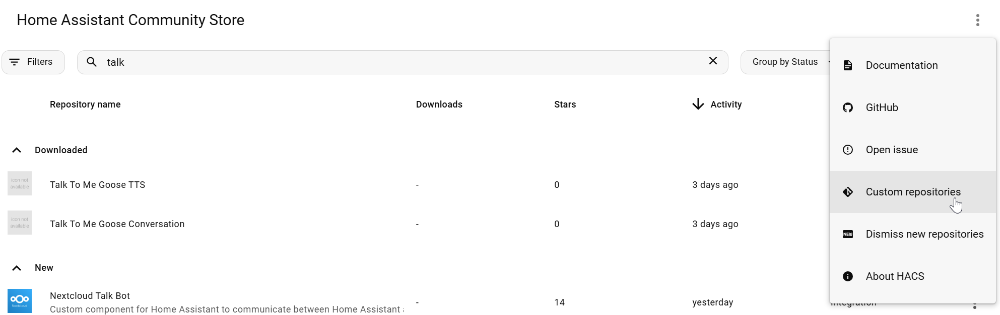

# Talk To Me Goose (HASS Integration - TTS)

This is a custom integration for Home Assistant to work with [Talk To Me Goose Server](https://github.com/eslavnov/ttmg_server). It will call TTMG Server and it is needed for things like local agent's responses.

**Installation:**
1. If you are using [HACS](https://www.hacs.xyz/), you can add this repo as a custom repository with the type "Integration":
   
   Otherwise, you can manually copy `custom_components/ttmg_tts` to your custom components folder in Home Assistant.
2. Restart Home Assistant.
3. Go to [integrations](https://my.home-assistant.io/redirect/integrations/) and search for "Talk To Me Goose TTS".

## Change log

### v1.0.1
**Added**
- Local conversation agent's responses are now working too!

### v1.0.0
**Added**
- Initial release
